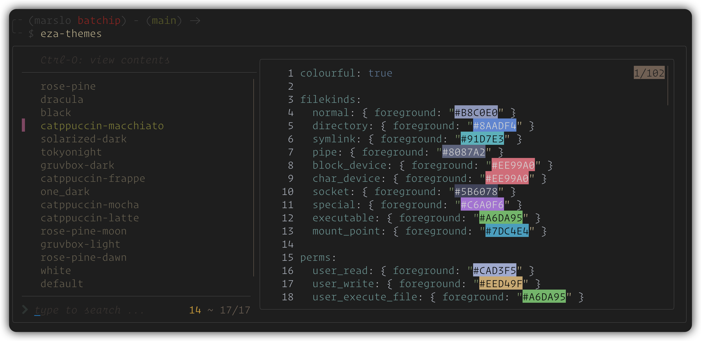
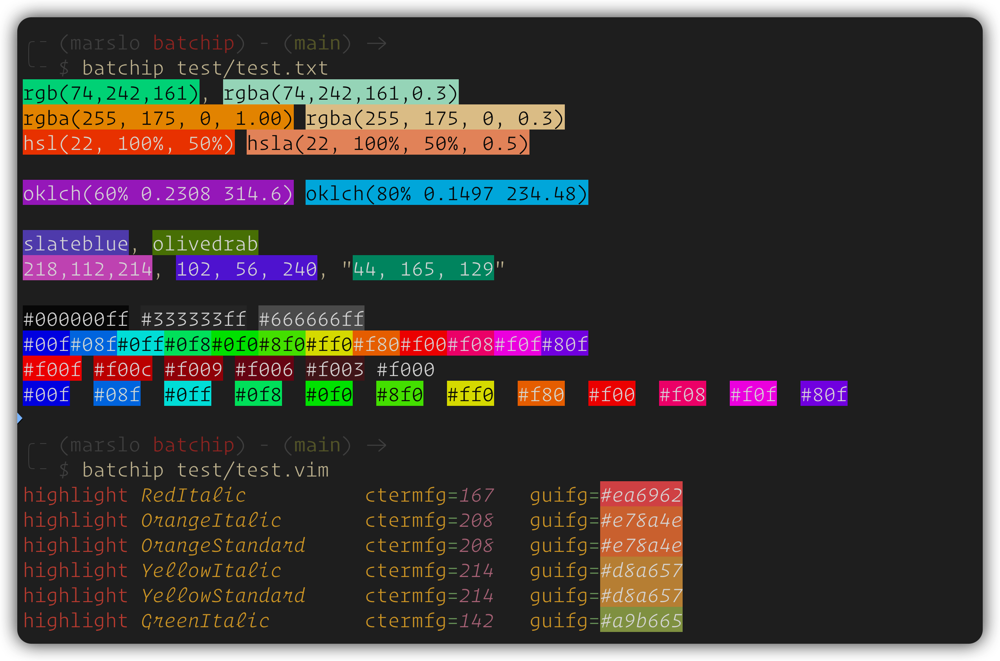

# batchip

A powerful wrapper for bat that instantly renders CSS color codes (Hex, RGB, HSL, Oklch, Named Colors) in your terminal using TrueColor, featuring smart contrast (Rec. 709 Luma) and alpha blending

---


`batchip` is a [`bat`](https://github.com/sharkdp/bat) wrapper that renders color swatches — inline, in your terminal.

Hex codes, RGB/HSL values, and named CSS colors are highlighted in their actual color, bringing the color preview to your CLI.

---

# Table of Contents

- [Supported color formats](#supported-color-formats)
- [Demo](#demo)
- [Features](#features)
- [Installation](#installation)
  - [Prerequisites](#prerequisites)
  - [Setup](#setup)
    - [setup bash completion](#setup-bash-completion)
- [Usage](#usage)
  - [run as command](#run-as-command)
  - [run as a filter (pipe)](#run-as-a-filter-pipe)
  - [alias to bat](#alias-to-bat)
  - [fzf-preview](#fzf-preview)
- [others](#others)
  - [How it Works (The Math)](#how-it-works-the-math)
  - [related discussion](#related-discussion)
- [License](#license)

---

# Supported color formats

| COLOR FORMAT | EXAMPLE                                            |
|--------------|----------------------------------------------------|
| Hex          | `#fff`, `#AABB11AA`, `#f00f`, `"A0CC2F"`           |
| RGB/RGBA     | `rgb(74, 242, 161)`, `rgba(74, 242, 161, 0.3)`     |
| HSL/HSLA     | `hsl(120, 100%, 50%)`, `hsla(120, 100%, 50%, 0.5)` |
| Oklch        | `oklch(50% 0.5 120)`, `oklch(0.6 0.27 30 / 0.3)`   |
| Bare Tuples  | `255, 50, 127` or `218,112,214`                    |
| Named Colors | `slateblue`, `olivedrab`, `aliceblue`, etc         |

---

# Demo

> [!TIP]
> - check [`fzf-preview.sh`](https://github.com/marslo/dotfiles/raw/main/.marslo/bin/fzf-preview.sh) for full support

<video src="https://github.com/user-attachments/assets/268202bc-e600-464f-8f4c-0e674f9e444d" width="90%" autoplay loop muted playsinline>batchip integrate with fzf-preview</video>


|         INTEGRATE IN FZF-PREVIEW         |             RUN AS COMMAND            |
|:----------------------------------------:|:-------------------------------------:|
|  |  |

---

# Features

- **Broad Format Support**: Parses and colorizes almost all standard color formats:
  - *Hex**: 3, 4, 6, and 8-bit hex codes (e.g., `#fff`, `#AAbB11aa`, `"A0CC2F"`).
  - **RGB/RGBA**: `rgb(74, 242, 161)`, `rgba(74, 242, 161, 0.3)`.
  - **HSL/HSLA**: `hsl(120, 100%, 50%)`, `hsla(120, 100%, 50%, 0.5)`.
  - **Oklch**: `oklch(50% 0.5 120)`, `oklch(0.6 0.27 30 / 0.3)`.
  - **Bare Tuples**: `255, 50, 127` or `218,112,214`.
  - **Named Colors**: `slateblue`, `olivedrab`, `aliceblue`, etc.
  - **Smart Contrast (Rec. 709 Luma)**: Automatically calculates the perceived brightness of the background color and switches the foreground text to absolute Black or White for maximum readability. It accurately handles high-luminance colors like pure green (`#00ff00`).
  - **Alpha Blending**: Fully supports opacity in 4/8-bit Hex and RGBA/HSLA by calculating real-time alpha blending against a dark terminal background.
  - **TrueColor Isolation**: Uses 24-bit TrueColor (`\033[38;2;...`) for both background and foreground, completely bypassing terminal ANSI palette overrides (like those in Gruvbox, Dracula, etc.) to ensure 100% color accuracy.
  - **Seamless `bat` Integration**: Forwards all arguments (like `--paging`, `-l`) directly to `bat`. It preserves your existing syntax highlighting and layout.

# Installation

## Prerequisites
Make sure you have the following installed on your system:
- [x] `bat`
- [x] `perl` (with `JSON::PP` module, usually pre-installed)
- [x] `curl` (for initial color-names JSON download)

## Setup

> [!TIP]
> make sure the directory ( i.e., `~/.local/bin`) is in your PATH

```bash
curl -fsSl -O ~/.local/bin/batchip https://github.com/marslo/batchip/raw/main/batchip
chmod +x ~/.local/bin/batchip
```

> [!NOTE]
> - set `COLOR_NAMES_JSON` environment variable:
>   ```bash
>   export COLOR_NAMES_JSON="/path/to/css-color-names.json"
>   ```
> - the `css-color-names.json` will download automatically on first run

```bash
# manual download show color names
curl -fsSL -o "${COLOR_NAMES_JSON:-$HOME/.config/css-color-names.json}" \
     https://github.com/bahamas10/css-color-names/raw/master/css-color-names.json
```

### setup bash completion

```bash
# put into ~/.bashrc or ~/.bash_profile
type -P batchip >/dev/null && complete -o default -o bashdefault -F _bat batchip
```


# Usage

## run as command
```bash
# preview a css file with inline colors
batchip styles.css

# use bat arguments (e.g., specific language and line numbers)
batchip -l javascript index.js
```


## run as a filter (pipe)

> [!TIP]
> to preserves syntax highlighting with bat in piped mode, make sure to include `--color=always`
> - without `--color=always`:
>   ```bash
>   $ command bat style.css | command cat -A
>   .note { --bg-color: rgba(9, 105, 218, 0.15) }$
>   ```
> - with `--color=always`:
>   ```bash
>   $ command bat --color always style.css | command cat -A
>   ^[[38;2;146;131;116m   1^[[0m ^[[38;2;184;187;38m.^[[0m^[[38;2;250;189;47mnote^[[0m^[[38;2;251;241;199m ^[[0m^[[38;2;131;165;152m{^[[0m^[[38;2;251;241;199m ^[[0m^[[3;38;2;69;133;136m--^[[0m^[[3;38;2;131;165;152mbg-color^[[0m^[[38;2;131;165;152m:^[[0m^[[38;2;251;241;199m ^[[0m^[[38;2;142;192;124mrgba^[[0m^[[38;2;189;174;147m(^[[0m^[[3;38;2;211;134;155m9^[[0m^[[38;2;131;165;152m,^[[0m^[[38;2;251;241;199m ^[[0m^[[3;38;2;211;134;155m105^[[0m^[[38;2;131;165;152m,^[[0m^[[38;2;251;241;199m ^[[0m^[[3;38;2;211;134;155m218^[[0m^[[38;2;131;165;152m,^[[0m^[[38;2;251;241;199m ^[[0m^[[3;38;2;211;134;155m0^[[0m^[[3;38;2;131;165;152m.^[[0m^[[3;38;2;211;134;155m15^[[0m^[[38;2;189;174;147m)^[[0m^[[38;2;251;241;199m ^[[0m^[[38;2;131;165;152m}^[[0m$
>   ```

```bash
# pipe output into batchip
cat palette.json | batchip -l json

# using bat --color=always to preserve syntax highlighting in piped mode
bat --color=always style.css | batchip
```

|                    run with `bat`                   |                      run with `cat`                      |
|:---------------------------------------------------:|:--------------------------------------------------------:|
|  |  |

## alias to bat
```bash
alias bat='batchip'

# or
alias bat='/path/to/batchip'
```


## fzf-preview

```bash
# find bat: batchip > batcat > bat
declare -a _BAT_CMD=( $(type -P batchip || type -P batcat || type -P bat) )
# bat options
if [[ "${#_BAT_CMD[@]}" -eq 1 ]]; then
  _BAT_CMD+=( --style="${BAT_STYLE:-numbers}" --theme='Nord' --color=always --pager=never --line-range :500 )
else
  # fallback to cat
  _BAT_CMD=( type -P cat )
fi

# integration in fzf
fzf --preview "${_BAT_CMD[*]} -- {}"
# or
fzf --preview "$(printf '%q ' "${_BAT_CMD[@]}") -- {}"
# or (bash > 4.4+)
fzf --preview "${_BAT_CMD[*]@Q} -- {}"
```

# others

## How it Works (The Math)

> [!TIP]
> - Why not just use standard ANSI colors?
>> Standard terminal ANSI bright white (index `97`) or black (index `30`) are often "softened" by terminal color schemes.
>> When placing text over a vividly colored background, this causes muddy contrast and subpixel anti-aliasing artifacts
>
> - [Rec. 601](https://en.wikipedia.org/wiki/Rec._601)
>> `0.299 * R + 0.587 * G + 0.114 * B`

batchip solves this by:

- [**Luma Calculation**](https://en.wikipedia.org/wiki/Luma_(video)): Utilizing the [`Rec. 709`](https://en.wikipedia.org/wiki/Rec._709) algorithm (`0.2126 * R + 0.7152 * G + 0.0722 * B`) to simulate human eye sensitivity to green light, ensuring text flips to black exactly when the background becomes subjectively "bright"
- **Absolute RGB**: Outputting strict `\033[38;2;255;255;255m` and `\033[38;2;0;0;0m` to force the terminal to render pure contrasting text

## related discussion

- [issues/2808](https://github.com/sharkdp/bat/issues/2808)
- [issues/2705](https://github.com/sharkdp/bat/issues/2705)

# License
This project is licensed under the MIT License. See the [LICENSE](LICENSE) file for details.
